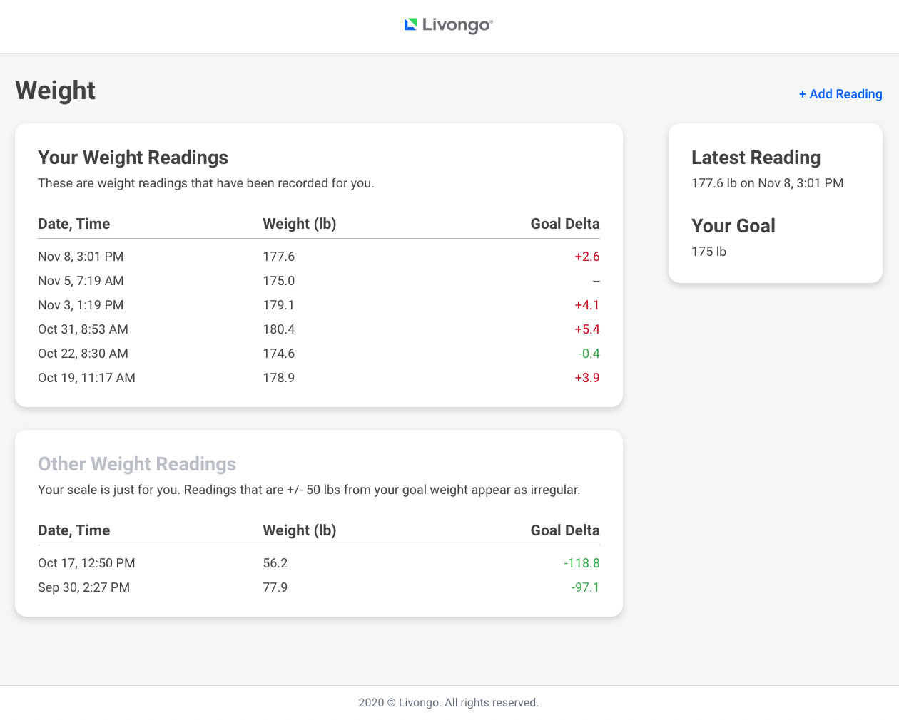
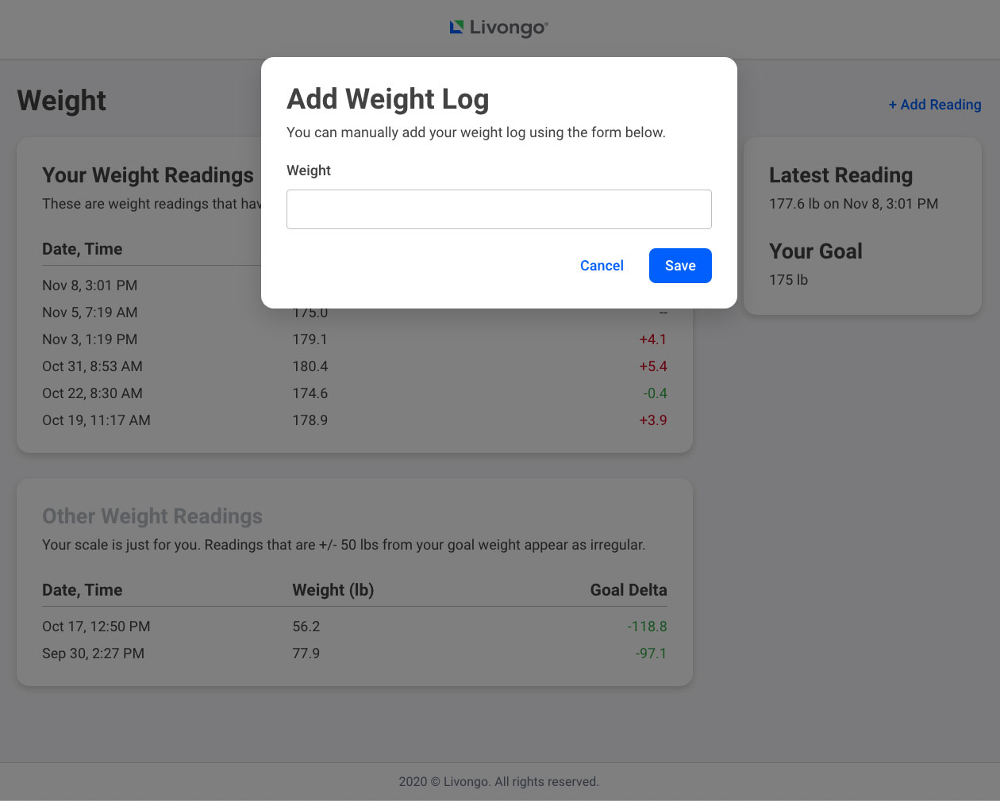
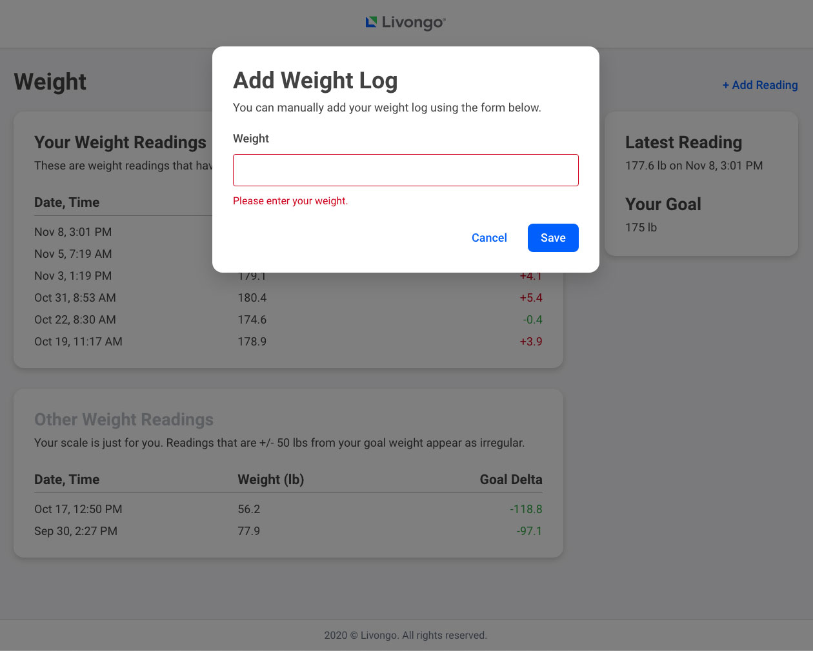

# Livongo's Front End engineering code challenge
The product manager has tasked you with implementing the designs for the Weight Management page. The following two features need to be completed in the next sprint. Familiarize yourself with the existing codebase to see what can be re-used.

## Feature #1
### Description
Members would like to see their recorded weight readings displayed on one page. The readings should be split up by "regular" and "irregular" to help distinguish which readings apply to them. This ensures that any readings that are not within a certain threshold (in this case, 50 lbs within the goal weight of 175 lbs) are not attributed to them (maybe a family member stepped on their scale?).

### Requirements
Implement the weight readings page and stay as close to [the design](./designs/01-weight.jpg) as possible.



## Feature #2
### Description
Members want the ability to manually add a weight reading in case their scale had a problem synchronizing.

### Requirements
Create a modal that allows a member to record their weight reading. The [form](./designs/02-add-log.jpg) should have proper [error handling](./designs/03-add-log-error.jpg) and only allow numbers to be entered.





## Directions
Feel free to use any additional open source tools and/or libraries to ensure proper completion of the two features.

1. `npm install`
1. `npm start`

You're now ready to implement your solution.

## Back End
The back end API is automatically started when `npm start` is executed.

**URL:** `http://localhost:9000/api`.

There is one route available that can accept both `GET` and `POST` requests.
* `GET /weights` - Retrieves all available weight readings.
* `POST /weights` - Adds a new weight reading. All properties are required.
    ```
    {
        id: int,
        value: number,
        dateTime: string,
        isIrregular: boolean
    }
    ```

## Extra Credit
* Are there any portions of the application that would make sense to unit/integration test?

## Submission
Once complete, please delete the `node_modules` directory and create a `.zip` file of your code. Send the zip file to your recruiter and they will forward it to the appropriate parties.

We know engineers are a busy bunch! Thank you for taking the time to complete this challenge and we hope you enjoyed it.
